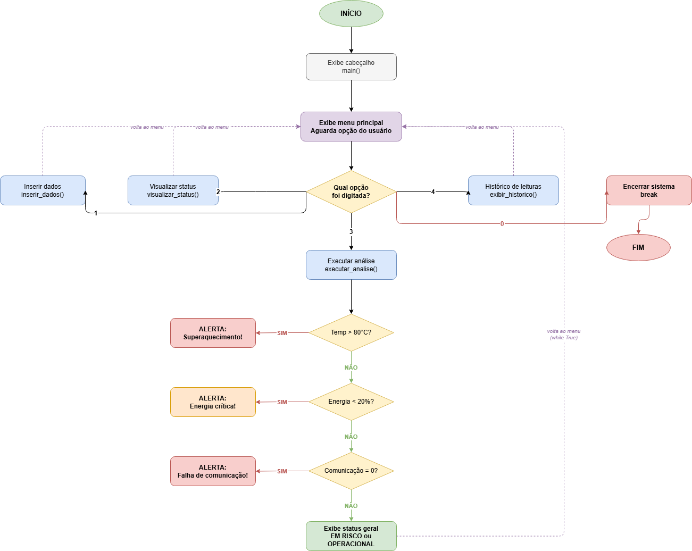

# Sistema de Monitoramento de Missão Espacial

> GS2026.1 — Programação Aplicada ao Monitoramento de Missão Espacial  
> Linguagem: Python 3 | Terminal interativo

---

## Integrantes

> Aneliza Rondina Bonafé - RM: 572977

> Rafaella Ferreira de Moraes - RM: 571030

---

## Índice

1. [Objetivo](#objetivo)
2. [Solução Desenvolvida](#solução-desenvolvida)
3. [Funcionalidades](#funcionalidades)
4. [Como Executar](#como-executar)
5. [Estrutura do Código](#estrutura-do-código)
6. [Recursos da Linguagem](#recursos-da-linguagem)
7. [Estruturas de Dados](#estruturas-de-dados)
8. [Regras de Análise](#regras-de-análise)
9. [Fluxograma](#fluxograma)
10. [Vídeo de Demonstração](#video)
11. [Conclusão](#conclusão)

---

## Objetivo

Simular o monitoramento computacional de uma missão espacial experimental. O sistema recebe dados operacionais de sensores (temperatura, energia e comunicação), analisa automaticamente se as condições estão dentro dos parâmetros seguros e emite alertas quando algum valor crítico é identificado.

---

## Solução Desenvolvida

O programa é um sistema de terminal interativo com menu numerado. O usuário navega pelas opções para inserir leituras de sensores, visualizar o status atual, executar análises automáticas e consultar o histórico da sessão.

O programa roda em loop contínuo (`while True`) até o usuário escolher encerrar. Cada funcionalidade é uma função separada, mantendo o código organizado e fácil de entender.

---

## Funcionalidades

| Opção | Função | Descrição |
|-------|--------|-----------|
| `1` | Inserir dados | Coleta temperatura, energia e status de comunicação |
| `2` | Visualizar status | Exibe os dados da última leitura registrada |
| `3` | Executar análise | Verifica condições críticas e exibe alertas |
| `4` | Histórico de leituras | Lista todas as leituras da sessão numeradas |
| `0` | Encerrar sistema | Finaliza o programa |


## Estrutura do Código

```
missao_espacial.py
│
├── historico []              # lista global que armazena todas as leituras
│
├── inserir_dados()           # coleta e valida entrada do usuário
├── verificar_condicoes()     # analisa uma leitura e retorna lista de alertas
├── visualizar_status()       # exibe dados da última leitura
├── executar_analise()        # chama verificar_condicoes() e exibe resultado
├── exibir_historico()        # percorre a lista e imprime todas as leituras
├── menu()                    # exibe o menu e retorna a opção digitada
└── main()                    # loop principal while True com controle do fluxo
```

---

## Recursos da Linguagem

### Estruturas Condicionais (`if / elif / else`)

Usadas para verificar as condições de alerta e para controlar qual função é chamada conforme a opção do menu.

```python
if leitura["temperatura"] > 80:
    alertas.append("ALERTA: Superaquecimento detectado!")
else:
    alertas.append("Temperatura normal.")
```

### Laços de Repetição (`while` e `for`)

`while True` controla o loop principal do programa e as validações de entrada. `for` percorre a lista de alertas e o histórico de leituras.

```python
# loop principal — só encerra com break
while True:
    opcao = menu()
    if opcao == "0":
        break

# percorre o histórico
for i in range(len(historico)):
    leitura = historico[i]
    print("Leitura", i + 1, ...)
```

### Tratamento de Erros (`try / except`)

Garante que o programa não trave se o usuário digitar texto onde se espera um número.

```python
try:
    temperatura = float(input("Temperatura da nave (graus C): "))
    break
except ValueError:
    print("Valor invalido. Digite um numero.")
```

### Funções com Parâmetro e Retorno

`verificar_condicoes(leitura)` recebe um dicionário e retorna uma lista de strings, separando a lógica de análise da lógica de exibição.

```python
def verificar_condicoes(leitura):
    alertas = []
    if leitura["temperatura"] > 80:
        alertas.append("ALERTA: Superaquecimento detectado!")
    # ...
    return alertas
```

---

## Estruturas de Dados

### Lista — `historico`

Funciona como um vetor dinâmico. Cada posição guarda um dicionário com os dados de uma leitura. Cresce conforme o usuário insere novos dados.

```python
historico = []             # começa vazia
historico.append(leitura)  # adiciona nova leitura
historico[-1]              # acessa a última leitura
```

### Dicionário — `leitura`

Cada leitura é um dicionário que associa nomes (chaves) aos valores dos sensores. Mais organizado do que usar três listas separadas.

```python
leitura = {
    "temperatura": 75.5,
    "energia": 18.0,
    "comunicacao": 1
}
```

---

## Regras de Análise

| Sensor | Condição crítica | Alerta emitido |
|--------|-----------------|----------------|
| Temperatura | `> 80 °C` | ALERTA: Superaquecimento detectado! |
| Energia | `< 20 %` | ALERTA: Energia critica - modo de economia ativado! |
| Comunicação | `== 0` (falha) | ALERTA: Falha na comunicacao! |

Se nenhuma condição crítica for encontrada, o status geral exibido é **MISSAO OPERACIONAL**. Caso contrário, **MISSAO EM RISCO**.

---

## Fluxograma



---

## Conclusão

O sistema cumpre todos os requisitos da atividade GS2026.1. Foi implementado em Python sem bibliotecas externas, de forma acessível para iniciantes, aplicando os principais conceitos vistos em aula:

- **Funções** com responsabilidades bem definidas
- **Lista** como vetor dinâmico para armazenar múltiplas leituras
- **Dicionário** para agrupar dados relacionados de forma legível
- **Condicionais** para tomada de decisão automatizada
- **Laços de repetição** para controle do fluxo e validação de entrada
- **try/except** para robustez na entrada de dados

O sistema pode ser expandido futuramente com geração de relatórios em arquivo, simulação automática de sensores via `random`, interface gráfica ou conexão com sensores físicos via Arduino/Raspberry Pi.

---

## Vídeo

Este é o link do vídeo explicativo do sistema e de sua utilização.

[Vídeo no Youtube](https://youtu.be/4zMQwxz-VyE)

---

*Atividade desenvolvida para GS2026.1 — Programação Aplicada ao Monitoramento de Missão Espacial*
